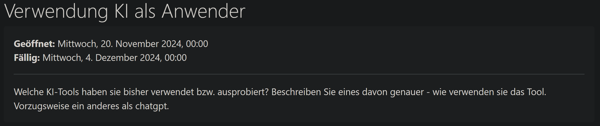
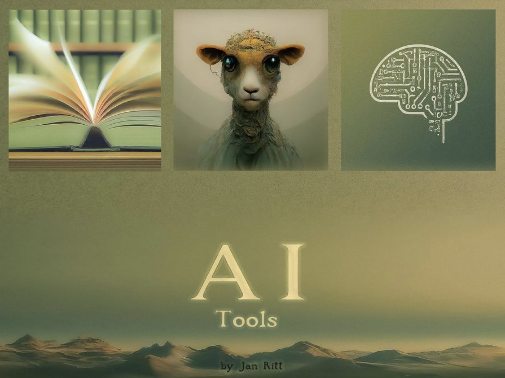
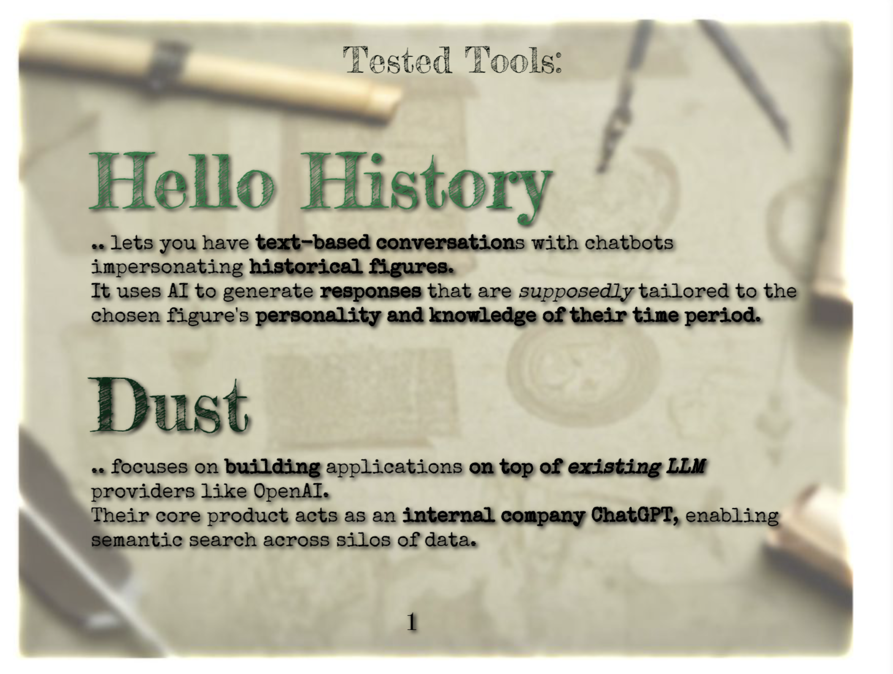
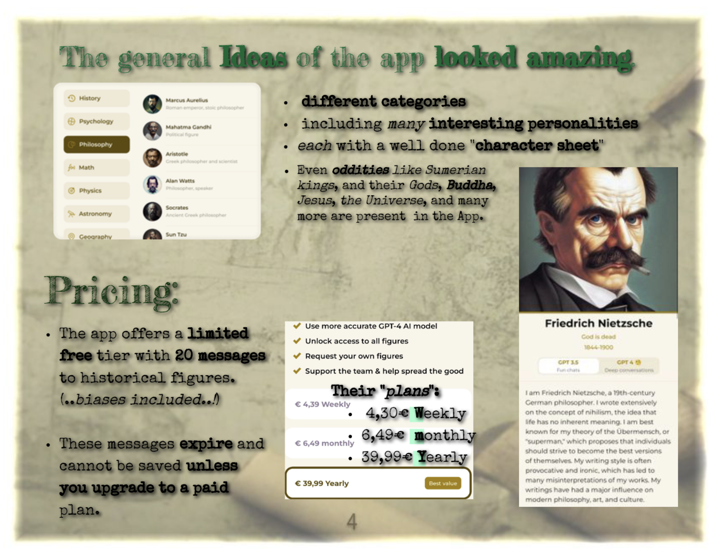
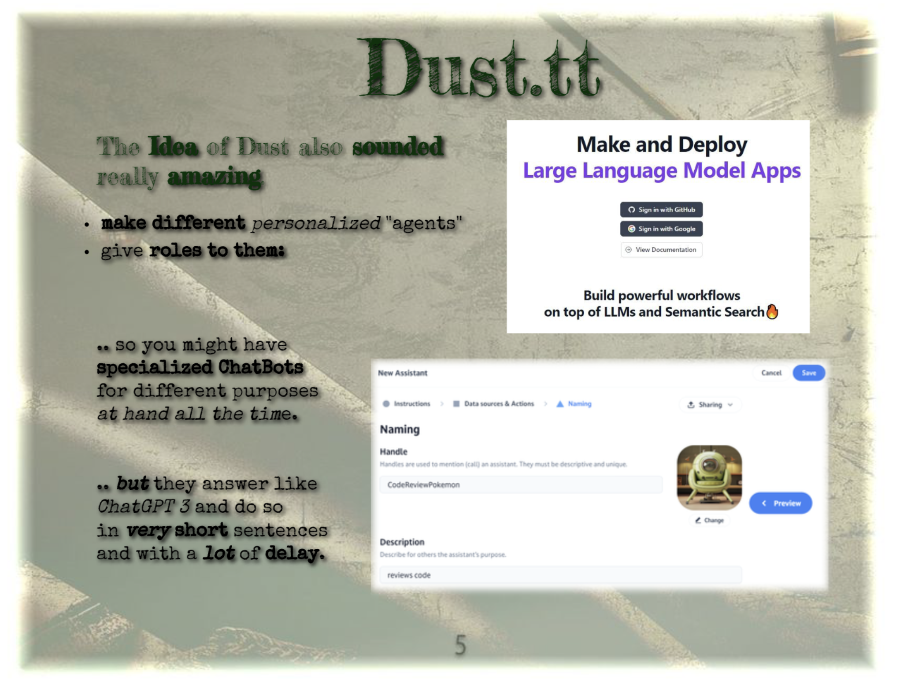
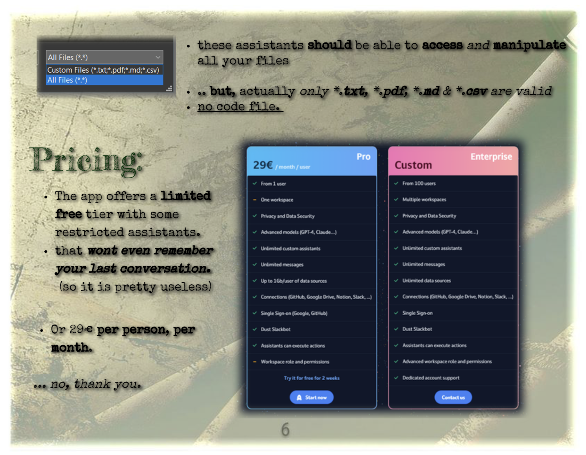

###### 
 DsaiUebung-005 -- AI (in use) 

<!--   -->

--- 

> - Because I am not regularly using any tools beside "Gemini", i chose to show of two more 'exotic' tools which I tested thoroughly.  
> - Both tools are - like many, that uses "AI" in their names - nothing more than a scam, unfortunate.  

- Hello History is heavily based torwards a "woke" & "political correct" audience - which feels VERRY OFF while "talking" to historic figures;  
- Also you can "talk" to Mao, Stalin and other horrible individuals, but same is NOT TRUE for anyone not on the far left... that's verry frustrating and feels like twisting history.   

---
 

---
# The tested "Tools":

 
 
 
 
 
 
